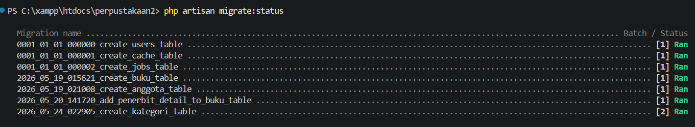
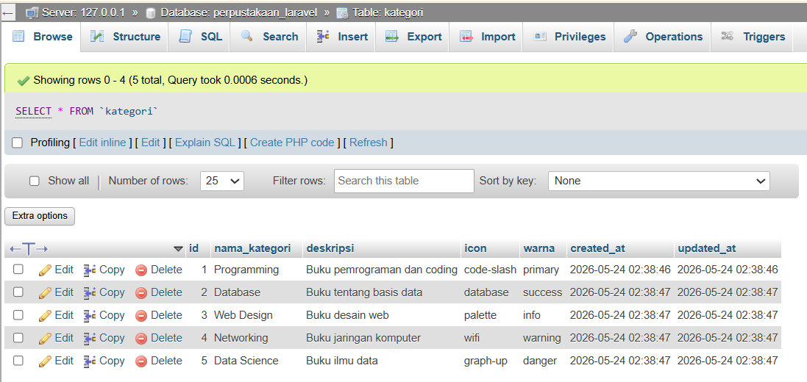
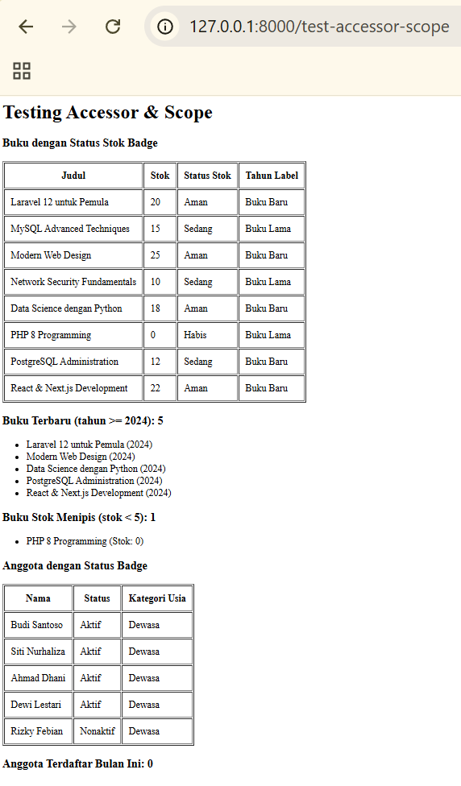

# Tugas Pemrograman Web Pertemuan 10

## Identitas
- Nama: Naufal Setyabagas Alifian
- NIM: 60324033
- Kelas: B
- Mata Kuliah: Pemorgraman Web 2

---

# Tugas yang dibuat

## Tugas 1 - Migration Tabel Kategori 
- Membuat migration untuk tabel `kategori`
- Membuat Model `Kategori` dengan fillable
- Membuat Seeder `KategoriSeeder` dengan 5 data kategori
- Struktur tabel: id, nama_kategori, deskripsi, icon, warna, timestamps

## Tugas 2 - Model Accessor & Scope 
- Menambahkan accessor `status_stok_badge` dan `tahun_label` pada Model Buku
- Menambahkan scope `stokMenipis`, `hargaRange`, dan `terbaru` pada Model Buku
- Menambahkan accessor `status_badge` dan `kategori_usia` pada Model Anggota
- Menambahkan scope `terdaftarBulanIni` pada Model Anggota
- Membuat route testing `/test-accessor-scope`

---

# Screenshot Hasil

> Semua screenshot disimpan di folder `image/`

## 1. Hasil Migration
Menampilkan status migration yang berhasil dijalankan.

---

## 2. Hasil Seeder (Data Kategori di Database)
Menampilkan 5 data kategori yang berhasil di-seed ke database.

---

## 3. Route `/test-accessor-scope`
Menampilkan hasil testing accessor dan scope pada Model Buku dan Anggota.

---
